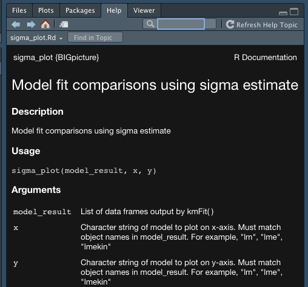

```{r include=FALSE}
knitr::opts_chunk$set(eval=FALSE)
```

# Summary

In this workshop, we introduce R packages and practice building one with common bioinformatics tools. Much of this material is modified from Hadley Wickham's book [R Packages](https://r-pkgs.org/index.html).

At the end of this workshop, you will be able to:

* Create an R package from scratch
* Utilize other R packages (CRAN, Bioconductor, GitHub) within your package
* Incorporate R functions into an existing R package

# Before you arrive
This workshop assumes no prior experience. However, you will need to complete the following steps prior to the workshop.

* Download and install R <https://www.r-project.org/>
* Download and install RStudio (free version) <https://www.rstudio.com/products/rstudio/download/>

# Introduction
R packages are reproducible bundles of code. They represent what many think of as the final step in reproducible coding as you progress from scripts to functions to packages.

Some benefits of R packages as compared to R functions and scripts are:

* Easy install with all dependencies
* Quick loading of multiple functions with `library( )`
* Accessible example data and often vignettes
* Heavily tested in multiple scenarios
* Single, version-controlled copy often housed in public repo

So, when do you make the jump from functions to packages? It is up to you to consider if the benefits of a package outweigh the time to produce and maintain one. If you use the same function in multiple projects, many people use the same function, and/or multiple functions are often used together, you will likely benefit from bundling everything into a package. Making a package also forces you to more robustly test functions and will improve your function writing overall.

# Creating an R package
## Overall process

Creating an R package in a iterative process. You will use the same code repeatedly to test your package until is passes all tests. You may wish to save this code in an R script but we will not build live notes like we normally do in a workshop. My package building script is provided at the end of these notes.

## Packages to help you make a package

Maybe not surprisingly, there are R packages to help you make R packages! First install these packages.

```{r}
install.packages(c("devtools","usethis","roxygen2"))
```

Then load these packages.

```{r}
library(devtools)
library(roxygen2)
```

## Package skeleton
You can create the skeleton of a package with `create_package( )`. Input the full path where you would like to save this package locally.

```{r}
usethis::create_package("~/Documents/GitHub/BIGslu/R_packages/BIGpicture")
```

```
## ✓ Setting active project to '/Users/kim/Documents/GitHub/BIGslu/R_packages/BIGpicture'
```
```
## ✓ Leaving 'DESCRIPTION' unchanged
```
```
## Package: BIGpicture
## Title: What the Package Does (One Line, Title Case)
## Version: 0.0.0.9000
## Authors@R (parsed):
##     * First Last <first.last@example.com> [aut, cre] (YOUR-ORCID-ID)
## Description: What the package does (one paragraph).
## License: `use_mit_license()`, `use_gpl3_license()` or friends to pick a
##     license
## Encoding: UTF-8
## LazyData: true
## Roxygen: list(markdown = TRUE)
## RoxygenNote: 7.1.2
```
```
## ✓ Setting active project to '<no active project>'
```

This will open a new R session in an R project formatted for packages. This automatically creates a number of files including the following.

* `.Rbuildignore` lists files needed for package development but that will be ignored when building the R package
* `.gitignore ` anticipates Git usage and ignores standard files created by R and RStudio
* `DESCRIPTION` contains package metadata
* `NAMESPACE` denotes internal functions and external R packages used by your package. *Do not* edit this file by-hand
* `R/` directory to hold R scripts with functions
* `BIGpicture.Rproj` RStudio Project

## Version control
You do not have to version control your package, but it is strongly recommended. You can auto setup git with `use_git( )`and allow RStudio to create the first commit like so.

```{r}
usethis::use_git()
```

```
✓ Setting active project to '/Users/kim/Documents/GitHub/BIGslu/R_packages/BIGpicture'
✓ Initialising Git repo
✓ Adding '.Rhistory', '.Rdata', '.httr-oauth', '.DS_Store' to '.gitignore'
There are 5 uncommitted files:
* '.gitignore'
* '.Rbuildignore'
* 'BIGpicture.Rproj'
* 'DESCRIPTION'
* 'NAMESPACE'
Is it ok to commit them?

1: Nope
2: No way
3: For sure

Selection: 3
```
```
✓ Adding files
✓ Making a commit with message 'Initial commit'
• A restart of RStudio is required to activate the Git pane
Restart now?

1: Absolutely not
2: Negative
3: Absolutely

Selection: 3
```

This is the last time RStudio needs to restart during package development. So we will reload our development packages and no longer need to call them for each function with `::`

```{r}
library(devtools)
library(roxygen2)
```

## Add a function
You will generally not start package development until you have a working function to incorporate. For this package, we will add a function to plot model fit `sigma` comparisons between two models run in `kimma::kmFit( )`. The original function:

```{r}
library(kimma)
#Linear models
model_result <- kmFit(dat = example.voom, kin = example.kin, patientID = "donorID",
                      run.lmekin = TRUE, run.lme = TRUE,
                      model = "~ virus + (1|donorID)", processors = 6)

#plot fxn
sigma_plot <- function(model_result, x, y){
  library(tidyverse)

  #Extract results
  dat_x <- model_result[[x]] %>%
    distinct(model,gene, sigma)
  dat_y <- model_result[[y]] %>%
    distinct(model,gene, sigma)
  #Merge and format
  dat <- bind_rows(dat_x,dat_y) %>%
    pivot_wider(names_from = model, values_from = sigma) %>%
    #add best fit variable
    mutate(`Best fit` = ifelse(get(x)<get(y), x,
                               ifelse(get(y)<get(x), y, "none")))

  #plot
  plot <- ggplot(dat, aes(x=get(x), y=get(x), color=`Best fit`)) +
    geom_point(alpha=0.3) +
    labs(x=x, y=y) +
    geom_abline() +
    theme_classic()

  message("Total genes best fit by")
  table(dat$`Best fit`)
  return(plot)
}

#test fxn
sigma_plot(model_result, x="lme", y="lmekin")
```

We don't want to simply copy this script to our package's `R/` directory. Instead, we ensure correct setup by creating a new script with `use_r( )`

```{r}
use_r("sigma_plot")
```

```
✓ Setting active project to '/Users/kim/Documents/GitHub/BIGslu/R_packages/BIGpicture'
• Modify 'R/sigma_plot.R'
• Call `use_test()` to create a matching test file
```

This opens a new R script where we copy just the function part of our original script.

```{r}
sigma_plot <- function(model_result, x, y){
  library(tidyverse)

  #Extract results
  dat_x <- model_result[[x]] %>%
    distinct(model,gene, sigma)
  dat_y <- model_result[[y]] %>%
    distinct(model,gene, sigma)
  #Merge and format
  dat <- bind_rows(dat_x,dat_y) %>%
    pivot_wider(names_from = model, values_from = sigma) %>%
    #add best fit variable
    mutate(`Best fit` = ifelse(get(x)<get(y), x,
                               ifelse(get(y)<get(x), y, "none")))

  #plot
  plot <- ggplot(dat, aes(x=get(x), y=get(x), color=`Best fit`)) +
    geom_point(alpha=0.3) +
    labs(x=x, y=y) +
    geom_abline() +
    theme_classic()


  message("Total genes best fit by")
  table(dat$`Best fit`)
  return(plot)
}
```

We can test this function within the package environment by loading it with `load_all( )`

```{r}
load_all()
```
```
ℹ Loading BIGpicture
Warning message:

── Conflicts ───────────────────────────────────────────────────────────── BIGpicture conflicts ──
x sigma_plot() masks BIGpicture::sigma_plot()

Did you accidentally source a file rather than using `load_all()`?
Run `rm(list = c("sigma_plot"))` to remove the conflicts. 
```

Because we have `sigma_plot` in our current R environment from testing the original script, R finds a conflict *i.e.* two functions by the same name. If we remove the original script's function from the environment, we resolve this conflict. Now the only copy of `sigma_plot` is from the `BIGpicture` package. 

```{r}
rm(list = c("sigma_plot"))
load_all()
```
```
ℹ Loading BIGpicture
```

If we call `sigma_plot( )` in this session, R will use the `BIGpicture` function even though we do not have this package installed. This allows you to test your functions like a user while still in the development phase.

In your workflow, this would be a good point to make a git commit! 

## Test your package

`devtools` runs a number of standard checks of packages including those needed for CRAN upload. We run all of these with `check( )` and see a number of issues with our package.

```{r}
check()
```
```
0 errors ✓ | 2 warnings x | 1 note x
```

The three types of issues are

* errors: package could not be built
* warnings: package was built but R strongly recommends changes
* notes: package was built but there are warnings that will likely result in one or more functions failing to work for someone who installs the package

Any of these issues would result in the package be denied upload to CRAN. Let's tackle each of these individually.

## License
The first warning notes that we do not have a license in our package. Thus, no one can use it!

```
> checking DESCRIPTION meta-information ... WARNING
  Non-standard license specification:
    `use_mit_license()`, `use_gpl3_license()` or friends to pick a
    license
  Standardizable: FALSE
```

You can choose your own license but we recommend GPL3.

```{r}
use_gpl3_license()
```
```
✓ Setting License field in DESCRIPTION to 'GPL (>= 3)'
✓ Writing 'LICENSE.md'
✓ Adding '^LICENSE\\.md$' to '.Rbuildignore'
```

If we rerun `check( )`, we see one fewer warnings now.

```{r}
check()
```
```
0 errors ✓ | 1 warning x | 1 note x
```

## Dependencies

Our function uses the `tidyverse` suite of packages. Thus, on its own, it will not work unless someone already has `tidyverse` installed and loaded in their R session.

```
> checking dependencies in R code ... WARNING
  'library' or 'require' call not declared from: ‘tidyverse’
  'library' or 'require' call to ‘tidyverse’ in package code.
    Please use :: or requireNamespace() instead.
    See section 'Suggested packages' in the 'Writing R Extensions' manual.
```

Within our package, we need to tell R to install and load all dependencies automatically. This is done with `use_package( )`. Since `tidyverse` is actually a bunch of packages, we must call each individual package instead.

```{r}
use_package("dplyr")
use_package("tidyr")
use_package("ggplot2")
```
```
✓ Adding 'dplyr' to Imports field in DESCRIPTION
• Refer to functions with `dplyr::fun()`

✓ Adding 'tidyr' to Imports field in DESCRIPTION
• Refer to functions with `tidyr::fun()`

✓ Adding 'ggplot2' to Imports field in DESCRIPTION
• Refer to functions with `ggplot2::fun()`
```

This added the following text to our `DESCRIPTION` file.

```
Imports: 
    dplyr,
    ggplot2,
    tidyr
```

After we've added the packages, we still have some related notes to address.

```
> checking R code for possible problems ... NOTE
  sigma_plot: no visible global function definition for ‘distinct’
  sigma_plot: no visible global function definition for ‘bind_rows’
  sigma_plot: no visible global function definition for ‘pivot_wider’
  sigma_plot: no visible global function definition for ‘mutate’
  sigma_plot: no visible global function definition for ‘ggplot’
  sigma_plot: no visible global function definition for ‘aes’
  sigma_plot: no visible global function definition for ‘geom_point’
  sigma_plot: no visible global function definition for ‘labs’
  sigma_plot: no visible global function definition for ‘geom_abline’
  sigma_plot: no visible global function definition for ‘theme_classic’
```

Within package functions, we must explicitly call each package when needed using `::`. So in our function, we need to add `dplyr::`, etc to each function in that package. We also remove the `library( )` call.

```{r}
sigma_plot <- function(model_result, x, y){
  #Extract results
  dat_x <- model_result[[x]] %>%
    dplyr::distinct(model,gene, sigma)
  dat_y <- model_result[[y]] %>%
    dplyr::distinct(model,gene, sigma)
  #Merge and format
  dat <- dplyr::bind_rows(dat_x,dat_y) %>%
    tidyr::pivot_wider(names_from = model, values_from = sigma) %>%
    #add best fit variable
    dplyr::mutate(`Best fit` = ifelse(get(x)<get(y), x,
                               ifelse(get(y)<get(x), y, "none")))

  #plot
  plot <- ggplot2::ggplot(dat, ggplot2::aes(x=get(x), y=get(x), color=`Best fit`)) +
    ggplot2::geom_point(alpha=0.3) +
    ggplot2::labs(x=x, y=y) +
    ggplot2::geom_abline() +
    ggplot2::theme_classic()

  message("Total genes best fit by")
  table(dat$`Best fit`)
  return(plot)
}
```

And we re-check.

```{r}
check()
```
```
0 errors ✓ | 0 warnings ✓ | 1 note x
```

### Non-CRAN dependencies
While not used in this package, you may need to access Bioconductor or GitHub packages within your package. To do this, you run `use_package( )` as we did for CRAN packages and then add the following to your `DESCRIPTION` file to tell R to look for packages outside CRAN.

For Bioconductor. No specifics are needed since package names are already listed under Imports.

```
biocViews:
```

For GitHub. Input the user and repo name of your desired package(s). 

```
Remotes: BIGslu/kimma, BIGslu/RNAetc
```

## Pipes
Pipes `%>%` are a common dependency the requires some special formatting in packages. This is why they are listed as a note instead of a warning.

```
> checking R code for possible problems ... NOTE
  sigma_plot: no visible global function definition for ‘%>%’
```

The pipe function is in the package `magrittr` but `use_package("magrittr")` does not result in everything we need. So, there is `use_pipe( )` which does all we need!

```{r}
use_pipe()
```
```
✓ Adding 'magrittr' to Imports field in DESCRIPTION
✓ Writing 'R/utils-pipe.R'
• Run `devtools::document()` to update 'NAMESPACE'
```

This creates the file `R/utils-pipe.R` which contains everything R needs for pipes. `magrittr` was also added to our `DESCRIPTION`.

## Undefined variables

This leaves us with the following notes. These tell us there there are variables in our function with no default. They occur when variables not defined in the function are used or created within the function such as `select`, `mutate`, or `pivot_wider`.

```
> checking R code for possible problems ... NOTE
  sigma_plot: no visible binding for global variable ‘model’
  sigma_plot: no visible binding for global variable ‘gene’
  sigma_plot: no visible binding for global variable ‘sigma’
  sigma_plot: no visible binding for global variable ‘Best fit’
  Undefined global functions or variables:
    Best fit gene model sigma
  Consider adding
    importFrom("stats", "sigma")
  to your NAMESPACE file.
```

We resolve this note by defining each variable at the start of the function. I like to just keep a running list like so.

```{r}
model <- gene <- sigma <- `Best fit` <- NULL
```

Now all our checks pass!

```{r}
check()
```
```
0 errors ✓ | 0 warnings ✓ | 0 notes ✓
```

Now, you have a package! This is another good time to git commit! But there is a lot we can do to improve it.

# Documentation
## DESCRIPTION
Several steps thus far have modified the `DESCRIPTION` file. Open this file and add info about this package for the title, version, author, and description.

```
Package: BIGpicture
Title: Standard Plots for BIGslu
Version: 0.0.1
Authors@R: 
    person(given = "Kim",
           family = "Dill-McFarland",
           role = c("aut", "cre"),
           email = "kadm@uw.edu")
Description: Create plots related to bioinformatic analyses.
License: GPL (>= 3)
Encoding: UTF-8
LazyData: true
Roxygen: list(markdown = TRUE)
RoxygenNote: 7.1.2
Imports: 
    dplyr,
    ggplot2,
    magrittr,
    tidyr
```

## Help pages
Each R function has a help page accessed with `?`. At this point, however, we have not provided any information for `sigma_plot` so no page is available.

Help pages are created using `roxygen2`, which we installed earlier but have not used yet. First, insert a template by opening `sigma_plot.R` and selecting Code > Insert roxygen skeleton under the RStudio menu bar. 

```
#' Title
#'
#' @param model_result 
#' @param x 
#' @param y 
#'
#' @return
#' @export
#'
#' @examples
```

Then fill in the appropriate information. It is best practices to include the data type (character, vector, data frame, etc) in each variable's description.

```
#' Model fit comparisons using sigma estimate
#'
#' @param model_result List of data frames output by kmFit( )
#' @param x Character string of model to plot on x-axis. Must match object names in model_result. For example, "lm", "lme", "lmekin"
#' @param y Character string of model to plot on y-axis. Must match object names in model_result. For example, "lm", "lme", "lmekin"
#'
#' @return ggplot object
#' @export
#'
#' @examples
```

We next create the help pages with `document( )`. This makes a manual `man/` directory with `.Rd` files for each help page.

```{r}
document()
```
```
ℹ Updating BIGpicture documentation
ℹ Loading BIGpicture
Warning: [/Users/kim/Documents/GitHub/BIGslu/R_packages/BIGpicture/R/sigma_plot.R:10] @examples requires a value
Writing NAMESPACE
Writing NAMESPACE
Writing sigma_plot.Rd
```

And now anyone using the package can access the help page.

```{r}
?sigma_plot
```

{width=50%}

Running check will now also perform tests of the documentation. 

```{r}
check()
```
```
0 errors ✓ | 0 warnings ✓ | 0 note x
```

## Test on real data
Ever wonder about the "Examples" section at the end of R help pages? Why did the authors choose those specific examples? Why are some lines commented out? Why do some have tons and others none? 

Well, this section serves two purposes. 1) It gives the user example code for how to use the associated function. 2) It tests the function when you build the package. This second purpose is actually the more important one, though as an R user, you never see these tests. When you include example code, R runs it every time you run `check( )` and thus, you test your code on real data every time you make a change.

You may use base R example data in the example code or include your own custom example data relevant to your package. Here, we want `BIGpicture` to play nice with other BIGslu packages like `kimma`. Thus, we will provide our own example data.

### Example data
Data within your package is housed within the `data/` directory. Oftentimes, these date are a cleaned or reduced version of some other data set. It is highly recommended to use publicly available data and provide a cleaning script to produce the actual data used by the package. These documents generally live in `data-raw/`.

Setup the raw data files with

```{r}
usethis::use_data_raw()
```

This opens `DATASET.R` where we will paste in the data cleaning code from the original function script.

```
library(kimma)
#Linear models
model_result <- kmFit(dat = example.voom, kin = example.kin, patientID = "donorID",
                      run.lmekin = TRUE, run.lme = TRUE,
                      model = "~ virus + (1|donorID)", processors = 6)

usethis::use_data(model_result, overwrite = TRUE)
```

Running that final line of code, sets up the `data/` directory and saves our example data for the package.

```
✓ Adding 'R' to Depends field in DESCRIPTION
✓ Creating 'data/'
✓ Saving 'model_result' to 'data/model_result.rda'
• Document your data (see 'https://r-pkgs.org/data.html')
```

After loading `BIGpicture`, these data can be accessed simply as `model_result`.

### Data documentation
As usual, we check the package build after this change. We see a new warning that our data object has no documentation.

```{r}
check()
```
```
> checking for missing documentation entries ... WARNING
  Undocumented code objects:
    ‘model_result’
  Undocumented data sets:
    ‘model_result’
  All user-level objects in a package should have documentation entries.
  See chapter ‘Writing R documentation files’ in the ‘Writing R
  Extensions’ manual.

0 errors ✓ | 1 warning x | 0 note x
```

Documenting data is similar to a function except that it gets a new file in `R/` instead of this information being part of the data object itself. There is no template for data documentation so we modify an example to fit our needs. Generally, you want to include everything you'd get if you looked at the data with `str( )`

```{r}
str(model_result)
```

Which leads to documentation like the following in `R/model_result.R`

```
#' kmFit example model results
#'
#' @format List of 2:
#' \enumerate{
#' \item \strong{lme} A data frame with 1000 rows and 7 columns
#' \describe{
#'   \item{model}{character. Model name.}
#'   \item{gene}{character. ENSEMBL gene ID.}
#'   \item{variable}{character. Variable name.}
#'   \item{estimate}{numeric. Model estimate, log fold change.}
#'   \item{pval}{numeric. Significance estimate.}
#'   \item{sigma}{numeric. Model fit, mean residual error.}
#'   \item{FDR}{numeric. FDR corrected signficant estimate.}
#'       }
#'
#' \item \strong{lmekin} A data frame with 2000 rows and 7 columns
#' \describe{
#'   \item{model}{character. Model name.}
#'   \item{gene}{character. ENSEMBL gene ID.}
#'   \item{variable}{character. Variable name.}
#'   \item{estimate}{numeric. Model estimate, log fold change.}
#'   \item{pval}{numeric. Significance estimate.}
#'   \item{sigma}{numeric. Model fit, mean residual error.}
#'   \item{FDR}{numeric. FDR corrected signficant estimate.}
#'       }
#' }
#' @source \url{https://github.com/altman-lab/P259_pDC_public}
#' @references Dill-McFarland et al. 2021. Eosinophil-mediated suppression and Anti-IL-5 enhancement of plasmacytoid dendritic cell interferon responses in asthma. J Allergy Clin Immunol. In revision
#' @description A dataset containing linear mixed effects model results with and without genetic kinship correction. Raw data were obtained from the kimma package.
#' @docType data
#' @name model_result
#' @keywords datasets
"model_result"
```

Checking again, we have resolved the previous warning.

```{r}
check()
```
```
0 errors ✓ | 0 warnings ✓ | 0 note x
```

### Example code
Now that we have example data in our package, we can use it in example code in the function. Taking the test code we had in the original script, we add it to the roxygen header examples like so.

```
#' @examples
#' sigma_plot(model_result, x="lme", y="lmekin")
```

Re-running check results in no errors so we know that the above code successfully completes using our custom function.

```{r}
check()
```
```
0 errors ✓ | 0 warnings ✓ | 0 note x
```

If there was an error in the example code, `check( )` would provide the output of the failed code similar to running it in the R console. For example, if we did not specify the y variable as in `sigma_plot(model_result, x="lme")`, we would see the following. 

```
> checking examples ... ERROR
  Running examples in ‘BIGpicture-Ex.R’ failed
  The error most likely occurred in:
  
  > base::assign(".ptime", proc.time(), pos = "CheckExEnv")
  > ### Name: sigma_plot
  > ### Title: Model fit comparisons using sigma estimate
  > ### Aliases: sigma_plot
  > 
  > ### ** Examples
  > 
  > sigma_plot(model_result, x="lme")
  Error in UseMethod("distinct") : 
    no applicable method for 'distinct' applied to an object of class "NULL"
  Calls: sigma_plot -> %>% -> <Anonymous>
  Execution halted

1 error x | 0 warnings ✓ | 0 notes ✓
```

This error tells us that `distinct` is being run on a variable that does not exist, *e.g.* is NULL. To figure out what is going on, we would go back to the function and run it line-by-line until we reproduced the error.

## GitHub README
If you're planning to upload your package to GitHub, it is nice to have a README on the repo's homepage to let potential users know a bit about the package. You can create a template like so and customize it as desired.

```{r}
use_readme_rmd()
```
```
✓ Writing 'README.Rmd'
✓ Adding '^README\\.Rmd$' to '.Rbuildignore'
• Modify 'README.Rmd'
✓ Writing '.git/hooks/pre-commit'
```

# Kim's package script

```{r}
library(devtools)
library(roxygen2)

# Create package
create_package("")
use_git()

# Add function
use_r("")

# Add dependencies
use_package("")
use_pipe()

# Update DESCRIPTION for remote dependencies
## biocViews:
## Remotes: BIGslu/kimma, BIGslu/RNAetc
# https://r-pkgs.org/whole-game.html#edit-description

# Add license
use_gpl3_license()

# Build package
load_all()
document()
check()

# Add documentation
# RStudio menu: Code > Insert roxygen skeleton

# Create manual
build_manual(pkg = ".", path = "../")
```

# Additional resources

* Hadley Wickham's book [R Packages](https://r-pkgs.org/index.html)
* Karl Broman's [R package primer](https://kbroman.org/pkg_primer/)
* How to [submit to CRAN](https://www.mzes.uni-mannheim.de/socialsciencedatalab/article/r-package/#section6)

# R session

```{r}
sessionInfo()
```

***
