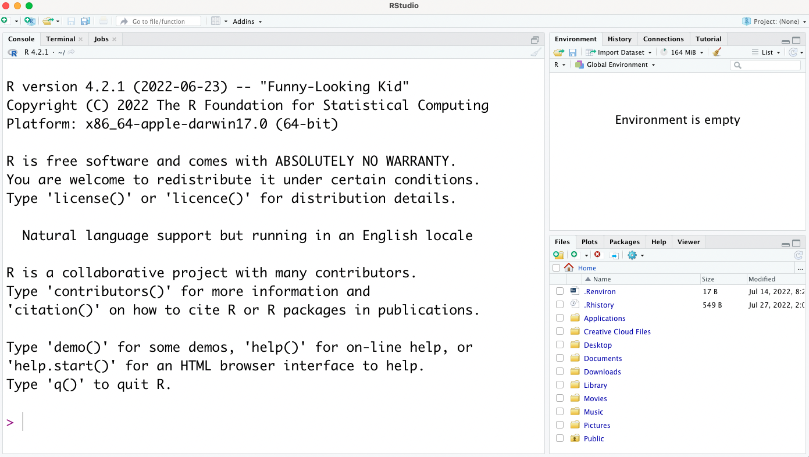

```{r, include=FALSE}
#set working dir to project
knitr::opts_knit$set(root.dir = rprojroot::find_rstudio_root_file())
```

# Prior to the workshop, please complete the following:

## Download the data

Please download the data in [data.zip](https://github.com/BIGslu/workshops/raw/main/2022.08.15_R.tidyverse.workshop/data/data.zip). Then, move data.zip to your Desktop and unzip it (usually double-clicking it will work).

If the above link does not work, please try downloading the data with Download button at <https://github.com/BIGslu/workshops/blob/main/2022.08.15_R.tidyverse.workshop/data/data.zip>.

## Install R and RStudio

* Install R, <https://cran.r-project.org/index.html>
    - If you already have R installed, please upgrade to version 4.1 or newer
* Install RStudio (free version), <https://www.rstudio.com/products/rstudio/download/>

When you open RStudio, it should look like so with multiple panels. If you see only 1 panel, then you’re likely in R, not RStudio.

{width=50%}

## Install R packages

Install R packages by running the following script in your R console (left panel in the above image).

```{r eval=FALSE}
#CRAN packages
install.packages("tidyverse")
install.packages("ggrepel")
#Bioconductor packages
install.packages("BiocManager")
BiocManager::install("limma")
```

*If prompted*, say `a` to "Update all/some/none? [a/s/n]" and `no` to "Do you want to install from sources the packages which need compilation? (Yes/no/cancel)"

**This can take several minutes.**

## Check R package install

To make sure packages are correctly installed, load them into R with `library( )`. **If you see any ERROR, please come 15 minutes early to the workshop the day of or contact Kim for assistance.**

First, the package(s) that give messages upon loading.

```{r}
library(tidyverse)
```

Then, check package(s) that load silently with no messages.

```{r}
library(limma)
library(ggrepel)
```

#### R package versions

For reproducibility, here is the complete list of software used in this workshop.

```{r}
sessionInfo()
```

# *Navigation*

* [Workshop index][index]
* Next lesson: [Intro to R and RStudio][lesson1]

***

[index]: https://bigslu.github.io/workshops/2022.08.15_R.tidyverse.workshop/index.html
[lesson0]: https://bigslu.github.io/workshops/2022.08.15_R.tidyverse.workshop/0_setup.html
[lesson1]: https://bigslu.github.io/workshops/2022.08.15_R.tidyverse.workshop/1_introR.html
[lesson2]: https://bigslu.github.io/workshops/2022.08.15_R.tidyverse.workshop/2_tidyverse.html
[lesson3]: https://bigslu.github.io/workshops/2022.08.15_R.tidyverse.workshop/3_ggplot.html
[workshop]: https://bigslu.github.io/workshops/2022.08.15_R.tidyverse.workshop/R_tidyverse_RNAseq_edition.html
