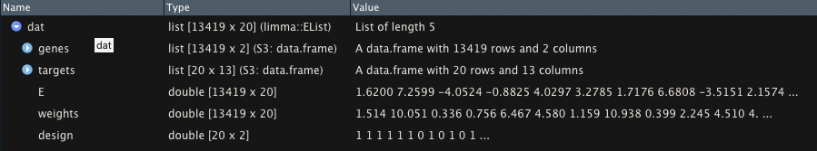

```{r include=FALSE}
knitr::opts_chunk$set(fig.width = 3, fig.height = 3)
```

# Introduction

Prior to this workshop, you should complete [setup and installation](https://bigslu.github.io/workshops/setup/setup.html).

In this workshop, we introduce you to R and RStudio at the beginner level. In it, we cover:

* R and RStudio including projects, scripts, and packages
* The help function
* Reading in data as a data frame and RData
* Data types

During the workshop, we will build an R script together. This will be posted with today's data under `live_notes/` after the workshop at <https://github.com/BIGslu/workshops/tree/main/introR.workshop/live_notes/>

## A Tour of RStudio

We will do all of our work in [RStudio](https://www.rstudio.com/). RStudio is an integrated development and analysis environment for R that brings a number of conveniences over using R in a terminal or other editing environments.

When you start RStudio, you will see something like the following window appear:


Notice that the window is divided into three "panes":

- Console (the entire left side): This is your view into the R engine. You can type in R commands here and see the output printed by R. (To make it easier to tell them apart, your input and the resulting output are printed in different colors.) There are several editing conveniences available: use up and down arrow keys to go back to previously entered commands, which can then be edited and re-run; TAB for completing the name before the cursor; see more in [online docs](http://www.rstudio.com/ide/docs/using/keyboard_shortcuts).

- Environment/History (tabbed in upper right): View current user-defined objects and previously-entered commands, respectively. The instructor may have additional tabs like Connection, Git, etc. These are not relevant to this workshop series.

- Files/Plots/Packages/Help (tabbed in lower right): As their names suggest, these are used to view the contents of the current directory, graphics created by the user, install packages, and view the built-in help pages.

To change the look of RStudio, you can go to Tools -> Global Options -> Appearance and select colors, font size, etc. If you plan to be working for longer periods, we suggest choosing a dark background color scheme to save your computer battery and your eyes.

### RStudio Projects

Projects are a great feature of RStudio. When you create a project, RStudio creates an `.Rproj` file that links all of your files and outputs to the project directory. When you import data, R automatically looks for the file in the project directory instead of you having to specify a full file path on your computer like `/Users/username/Desktop/`. R also automatically saves any output to the project directory. Finally, projects allow you to save your R environment in `.RData` so that when you close RStudio and then re-open it, you can start right where you left off without re-importing any data or re-calculating any intermediate steps.

RStudio has a simple interface to create and switch between projects, accessed from the button in the top-right corner of the RStudio window. (Labeled "Project: (None)", initially.)

##### Create a Project

Let's create a project to work in for this workshop. Start by clicking the "Project" button in the upper right or going to the "File" menu. Select "New Project" and the following will appear.

{width=50%}

You can either create a project in an existing directory or make a new directory on your computer - just be sure you know where it is.

After your project is created, navigate to its directory using your Finder/File explorer. You will see the `.RProj` file has been created. 

To access this project in the future, simply double-click the `.RProj` file and RStudio will open the project or choose File > Open Project from within an already open RStudio window.

### R Scripts

R script files are the primary way in which R facilitates reproducible research. They contain the code that loads your raw data, cleans it, performs the analyses, and creates and saves visualizations. R scripts maintain a record of everything that is done to the raw data to reach the final result. That way, it is very easy to write up and communicate your methods because you have a document listing the precise steps you used to conduct your analyses. This is one of R's primary advantages compared to traditional tools like Excel, where it may be unclear how to reproduce the results. 

Generally, if you are testing an operation (*e.g.* what would my data look like if I applied a log-transformation to it?), 
you should do it in the console (left pane of RStudio). If you are committing a step to your analysis (*e.g.* I want to apply a log-transformation to my data and then conduct the rest of my analyses on the log-transformed data), you should add it to your R script so that it is saved for future use. 

Additionally, you should annotate your R scripts with comments. In each line of code, any text preceded by the `#` symbol will not execute. Comments can be useful to remind yourself and to tell other readers what a specific chunk of code does. In my experience, there can never be too much commenting.

Let's create an R script (File > New File > R Script) and save it as `introR_live_notes.R` in your main project directory. If you again look to the project directory on your computer, you will see `introR_live_notes.R` is now saved there.

We will work together to create and populate the `introR_live_notes.R` script throughout this workshop. 

### R packages
#### CRAN

R packages are units of shareable code, containing functions that facilitate and enhance analyses. Packages are typically installed from [CRAN](https://www.r-project.org/) (The Comprehensive R Archive Network), which is a database containing R itself as well as many R packages. Any package can be installed from CRAN using the `install.packages` function. You should input installation commands into your console (as opposed to `live_notes.R`) since once a package is installed on your computer, you won't need to re-install it again.

You should have installed the following packages prior to the workshop. However, if you did not, here is the code again. `tidyverse` is a meta-package containing several packages useful in data manipulation and plotting.

You **DO NOT** need to run this again if you did so as part of the setup instructions. 

```{r eval=FALSE}
install.packages("tidyverse")
```

After installing a package, and *every time* you open a new RStudio session, the packages you want to use need to be loaded into the R workspace with the `library` function. This tells R to access the package's functions and prevents RStudio from lags that would occur if it automatically loaded every downloaded package every time you opened it. To put this in perspective, I had `r length(installed.packages(.Library, priority = "high"))` packages installed at the time this document was made.

```{r}
# Data manipulation and visualization
library(tidyverse)
```

Because `tidyverse` is a meta-package, it automatically tells you want packages it is loading and their versions. In addition, the Conflicts section let's you know  functions in the `tidyverse` that alter exist in your R session. Because you chose to load the package, calling the function `filter` will use the `tidyverse` function not the `stats` function (which comes with base R). If you for some reason needed the `stats` version, you can specify it with `package::` like `stats::filter`.

#### Bioconductor

[Bioconductor](https://www.bioconductor.org/) is another repository of R packages. It has different requirements for upload and houses many biology-relevant packages. To install from Bioconductor, you first install its installer from CRAN.

```{r eval=FALSE}
install.packages("BiocManager")
```

Then install your package of choice using the `BiocManager` installer. We install `limma`, a package for analysis of microarray and RNA-seq data.  Again, you did this in the setup instructions but the code is here again for reference.

*If prompted*, say `a` to "Update all/some/none? [a/s/n]" and `no` to "Do you want to install from sources the packages which need compilation? (Yes/no/cancel)"

```{r eval=FALSE}
BiocManager::install("limma")
```

## Getting started

Before doing anything in R, it is a good idea to set your random seed. Your analyses may not end up using a seed but by setting it, you ensure that *everything* is exactly reproducible.

The most common seeds are 0, 1, 123, and 42. You can use any number and change it up between scripts if you'd like.

```{r}
set.seed(4389)
```

### Organize data

Move the `data/` directory you downloaded *inside* your project directory. You can do this in your regular point-and-click file explorer.

### Loading data into R
### Data frames from `.csv`, `.tsv`, etc.

One of R's most essential data structures is the data frame, which is simply a table of `m` columns by `n` rows. First, we will read in the RNA-seq metadata into RStudio using the base R `read.table` function.

Each R function uses the following basic syntax, where `Function` is the name of the function.

```
Function(argument1=..., argument2=..., ...)
```

`read.table` has many arguments; however, we only need to specify 3 arguments to correctly read in our data as a data frame. For our data, we will need to specify:

* `file` - gives the path to the file that we want to load from our working directory (current project directory). 
* `sep` - tells R that our data are comma-separated
* `header` - tells R that the first row in our data contains the names of the variables (columns).

We will store the data as an *object* named `meta` using the assignment operator `<-`, so that we can re-use it in our analysis. 

```{r}
# read the data and save it as an object
meta_csv <- read.table(file="data/metadata.csv", sep=",", header=TRUE)
```

Now whenever we want to use these data, we simply call `meta_csv`

### Help function

You can read up about the different arguments of a specific function by typing `?Function` or `help(Function)` in your R console.

```{r}
?read.table
```

You will notice that there are multiple functions of the `read.table` help page. This include similar and related functions with additional options. For example, since our data are in `.csv` format, we could've instead read them into R with `read.csv` which assumes the options `sep=",", header=TRUE` by default. 

```{r eval=FALSE}
# read the data with different function
meta_csv <- read.csv(file="data/metadata.csv")
```

### Complex data from `.RData`

You may have data that do not fit nicely into a single table or into a table at all (like plots). You can save these as `.RData`, which can be loaded directly into R. You can also save multiple tables and/or other objects in a single `.RData` file to make loading your data quick and easy. Moreover, `.RData` are automatically compressed so they take up less storage space than multiple tables.

```{r}
load("data/metadata.RData")
```

Notice that these data appear already named in your R environment as `meta`. Object names are determined when saving so be sure to create short but descriptive names before saving to `.RData`.

## Data types
### Simple

Note that `meta` and `meta_csv` are the same data, just loaded from different files. Because the name is slightly shorter, we will explore `meta` for most of this section. This data frame consists of `r nrow(meta)` rows (observations) and `r ncol(meta)` columns (variables). You can see this quickly using the dimension function `dim`

```{r}
dim(meta)
```

Each column and each row of a data frame are individual R vectors. R vectors are one-dimensional arrays of data. For example, we can extract column vectors from data frames using the `$` operator.

```{r}
# Extract patient IDs
meta$ptID
```

R objects have several different classes (types). Our data frame contains 5 R data types. The base R `class` function will tell you what data type an object is.

```{r}
class(meta)
class(meta$ptID)
class(meta$condition)
```

We see that our `ptID` column is `character`, meaning it is non-numeric letters and characters. `condition` is a `factor`, meaning it is a character variable with discrete levels. A `character` variable can be anything while a `factor` can only be one of a set of pre-defined levels.

```{r}
meta$condition
class(meta$condition)

meta_csv$condition
class(meta_csv$condition)
```

One advantage of `.RData` is that is saves formatting not found in a `.csv`. Here, we see that the `condition` variable in `meta_csv` contains the same data as `meta` but `meta` from the `.RData` has `factor` formatting. Thus, `.RData` are a good way to save your data when you have factors or other within R formatting.

```{r}
class(meta$age_dys)
class(meta$total_seq)
class(meta$RNAseq)
```

Continuing on, `age_dys` is `numeric`, meaning a number, and `total_seq` is `integer`, meaning a whole number with no decimals. 

Finally, `RNAseq` is `logical` meaning TRUE/FALSE - which need to be all caps for R to recognize them as such.

You can see the entire structure of the data with `str`.

```{r}
str(meta)
```

### Complex (`S3`, `S4`)

We will not use this data type today. However, you may encounter it in our other workshops or in your own work.

`S3` and `S4` formats mean the data have > 2 dimensions. `S3` data are a list of multiple data frames, vectors, plots, etc. `S4` data can be lists or other specialty data types specific to an R package.

For example, RNA-seq data can be contained in an `S3` object from the `limma` package. This type of data is called an `EList` for "expression list" and contains data frames with gene metadata (`genes`), sample metadata (`targets`), normalized expression values (`E`), and others.



Similar to our `meta` data, you access pieces of an `S3` object with `$` only now, you can have multiple levels to go from the list object `data` to each data frame like `targets` to each column in that data frame like `ptID`. *You should not run this code as you have not loaded the `dat` object in this workshop.*

```{r eval=FALSE}
dat$genes
dat$targets$ptID
```

Working with `S4` objects is very similar to `S3` except that they are accessed with `@` instead of `$`. Again, we will not use these data types here and you can explore them further in more advanced workshops.

## Working with vectors and data frames
### Operating on vectors

A large proportion of R functions operate on vectors to perform quick computations over their values. Here are some examples:

```{r}
# Compute the variance of total number of sequences
var(meta$total_seq)

# Find whether any samples have greater than 10 million sequences
meta$total_seq > 10E6

# Find the unique values of metadata's condition
unique(meta$sex)
unique(meta$condition)
```

Note the difference between a character (`sex`) and a factor here (`condition`).

### Using the correct class

Functions executed on an object in R may respond exclusively to one or more data types or may respond differently depending on the data type. When you use the incorrect data type, you will get an error or warning message. For example, you cannot take the mean of a factor or character.

```{r error=TRUE}
# Compute the mean of libID
mean(meta$libID)
```

### Subsetting vectors and data frames

Since vectors are one dimensional arrays of a defined length, their individual values can be retrieved using vector indices. R uses 1-based indexing, meaning the first value in an R vector corresponds to the index 1. (Importantly, if you use python, that language is 0-based, meaning the first value is index 0.) Each subsequent element increases the index by 1. For example, we can extract the value of the 5th element of the `libID` vector using the square bracket operator `[ ]` like so.

```{r}
meta$libID[5]
```

In contrast, data frames are two dimensional arrays so indexing is done across both dimensions as `[rows, columns]`. So, we can extract the same library ID value directly from the data frame knowing it is in the 5th row and 1st column.

```{r}
meta[5, 1]
```

The square bracket operator is often used with logical vectors (TRUE/FALSE) to subset data. For example, we can subset our metadata to all `Media` observations (rows).

```{r}
# Create logical vector for which condition is Media
logical.vector <- meta$condition == "Media"
#View vector
logical.vector
#Apply vector to data frame to select only observations where the logical vector is TRUE
meta[logical.vector, ]
```

Subsetting is extremely useful when working with large data. Please find a reference of common statements used in subsetting below. You can also learn the `tidyverse` way to subset and work with data in our workshop [Intro to R and tidyverse](https://bigslu.github.io/workshops/2022.08.15_R.tidyverse.workshop/index.html).

### Quick reference: Conditional statements

Statement | Meaning
--------- | -------
`<-`      | Assign to object in environment
`==`      | Equal to
`!=`      | Not equal to
`>`       | Greater than
`>=`      | Greater than or equal to
`<`       | Less than
`<=`      | Less than or equal to
`%in%`    | In or within
`is.na()` | Is missing, *e.g* NA
`!is.na()`| Is not missing
`&`       | And
`|`       | Or

## Exercises: Intro R

1. Using help to identify the necessary arguments for the log function, compute the natural logarithm of 4, base 2 logarithm of 4, and base 4 logarithm of 4.

Using the `meta` data frame:

2. Using an R function, determine what data type the `ptID_old` variable is.
3. Using indexing and the square bracket operator `[]`:
    - determine what `libID` value occurs in the 9th row
    - return the `libID` for a library where `age_dys` equals 7300 and `condition` equals Media
4. Subset the data to observations where `ptID` equals "pt05" or "pt08". *Hint*: Use a logical vector with the conditional statements above. 

# *Navigation*

* [Workshop index][index]
* Previous lesson: [Setup and installation][lesson0]
* Suggested next lesson: [Data manipulation in dplyr and tidyr][lesson2]
* [Lesson source code][lesson1rmd]

***

[index]: https://bigslu.github.io/workshops/
[lesson0]: https://bigslu.github.io/workshops/setup/setup.html
[lesson2]: https://bigslu.github.io/workshops/2022.08.15_R.tidyverse.workshop/2_tidyverse.html
[lesson1rmd]: https://github.com/BIGslu/workshops/blob/main/introR.workshop/introR.Rmd
